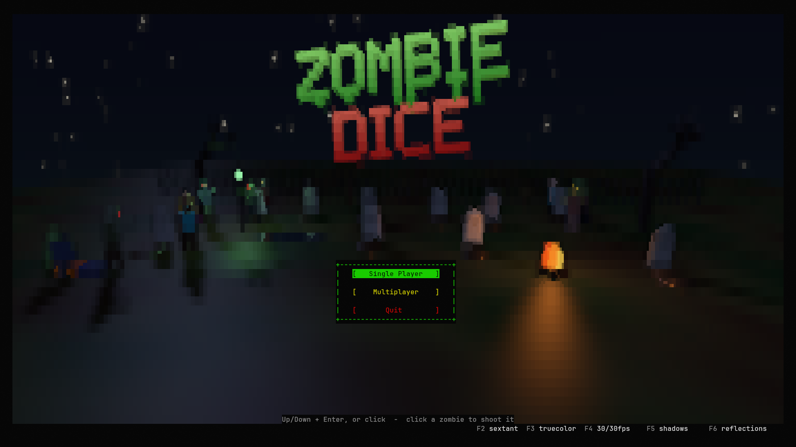
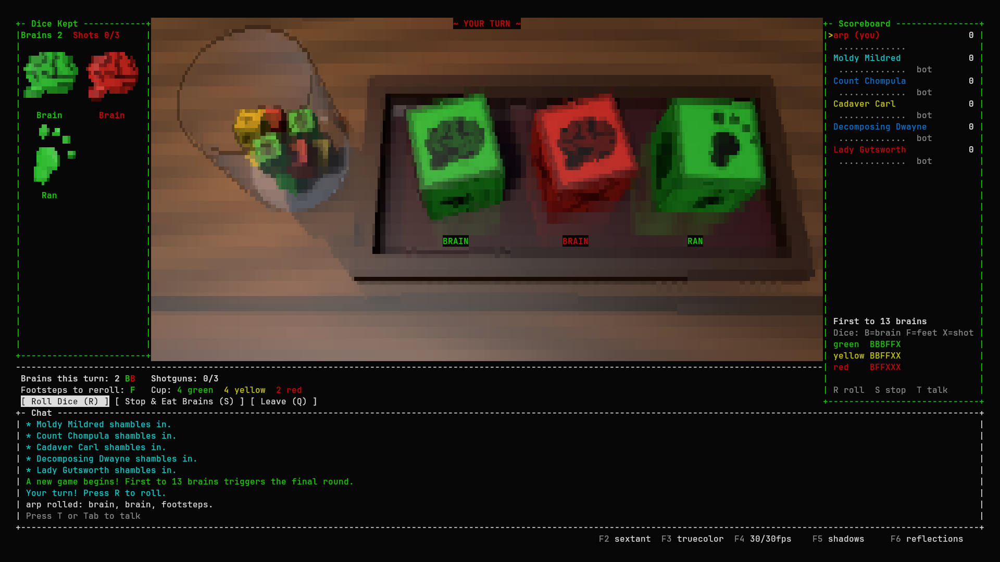
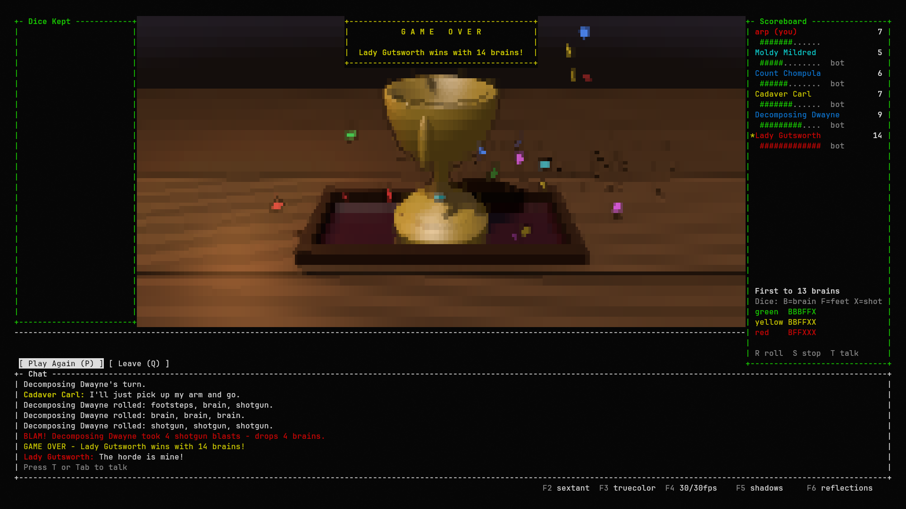

# zombieDice

Its Zombie Dice, but in 3D and in a terminal.







## Play

```sh
python3 -m venv .venv && . .venv/bin/activate   # Windows: py -m venv .venv; .venv\Scripts\activate
pip install -r requirements.txt                  # numpy, Numba, Pillow and unicode3d (Python 3.10 or later)
python3 -m zombie [--name NAME]                  # the game (needs an 80x24 terminal; bigger looks better)
```

Your player name defaults to your login name; `--name` (or the Multiplayer screen) changes it. The
first start compiles the 3D renderer, which takes 10-20 seconds ("First run compile, please
wait..."); later starts are quick.

**Windows, no Python needed:** download `ZombieDice-<version>-windows-x64.zip` from the
[Releases page](https://github.com/arp-Trosh/zombieDice/releases), extract it, and double-click
`ZombieDice.exe`. With Python installed you can also run it from source (`py -m zombie`). The display
is detected automatically.

### How to play

You're a zombie. On your turn you shake the cup and roll three dice, trying to eat as many brains
as you can before the humans shoot you three times. Keep pushing your luck, or stop and bank what
you have.

1. **Roll** (`R`). Three dice are drawn at random from the cup and rolled. Each face is one of:
   - **Brain**: you ate a brain. The die is set aside and counts toward this turn's total.
   - **Shotgun**: you got shot. The die is set aside. Three shotguns in one turn and you're done.
   - **Footsteps**: your victim ran. The die stays in your hand and is rolled again if you keep going.
2. **Decide.** Roll again (`R`) or **stop** (`S`) and add this turn's brains to your score.
   You must roll at least once before you can stop.
3. **Rolling again** always rolls three dice: your footstep dice first, topped up with new dice
   from the cup.
4. **Bust.** Reach 3 shotguns and your turn ends immediately, scoring nothing for that turn.
   Brains banked on earlier turns are safe.

### The rules

- **The cup** holds 13 dice, refilled and shuffled at the start of every turn:

  | die | count | brains | footsteps | shotguns | feel |
  |-----|:-----:|:------:|:---------:|:--------:|------|
  | green  | 6 | 3 | 2 | 1 | safe |
  | yellow | 4 | 2 | 2 | 2 | even |
  | red    | 3 | 1 | 2 | 3 | dangerous |

- **Running out of dice:** if the cup can't supply enough dice to make three, your brain dice go
  back into the cup (you keep credit for those brains) and the draw continues from there.
  Shotgun dice never go back.
- **Winning:** the first player to reach **13 brains** starts the **final round**: every other player
  gets one last turn. After that, the highest score wins; equal top scores
  share the win.
- Turn order follows the scoreboard, top to bottom.

---

*Disclaimer: This project was created with Claude Code.*
